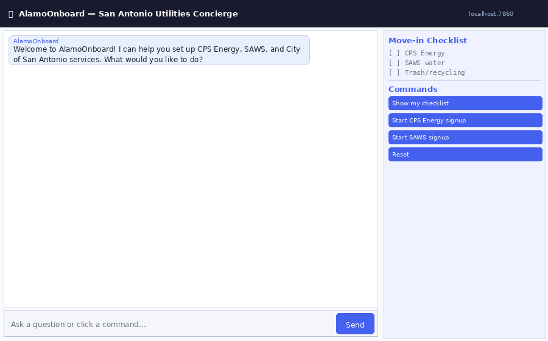

# AlamoOnboard

San Antonio utilities & city-services concierge. A conversational agent that helps new residents set up CPS Energy (electric & gas), SAWS (water & sewer), and City of San Antonio Solid Waste service through retrieval-augmented chat, field-by-field guided signup forms, and a persistent move-in checklist.

---

## Tech Stack

| Layer | Technology |
|---|---|
| UI | Gradio 6.x (Blocks, Chatbot, dynamic command buttons) |
| Agent | Custom orchestrator with OpenAI-compatible tool calling |
| LLM | `llama-3.3-70b-instruct-awq` (configurable via env var) |
| Retrieval | Hybrid BM25 + FAISS (Reciprocal Rank Fusion) |
| Embeddings | `sentence-transformers/all-MiniLM-L6-v2` (384-dim, CPU) |
| Vector store | FAISS `IndexFlatIP` + JSON metadata sidecar |
| Data pipeline | Custom web scraper + PDF extractor (CPS, SAWS, CoSA) |
| Persistence | JSON file (`output/user_state.json`) |
| Logging | Structured JSON with per-request `request_id` propagation |
| Containerization | Docker (multi-stage, non-root) + Docker Compose |
| Language | Python 3.11 |

---

## Quick Start (Docker — TA-recommended path)

```bash
# 1. Clone the repository
#    Replace the URL below with the actual repo URL from grading/manifest.yaml
git clone https://github.com/michaelg-utsa/alamo-Onboard
cd alamoonboard

# 2. Configure environment
cp .env.example .env
# Edit .env — fill in ALAMO_LLM_BASE_URL and ALAMO_LLM_API_KEY
# (leave ALAMO_DEMO_MODE=0; the app will run in demo mode automatically
#  if no API key is set, so all tests still pass without a live LLM)

# 3. Build and start
docker compose up

# 4. Open the app
# Navigate to http://localhost:7860
```

The app is ready when the Gradio welcome message appears (≤ 10 minutes on first run while the embedding model downloads).

To run the full data pipeline (scrape provider websites and rebuild the knowledge base):

```bash
make download-data    # scrape CPS Energy, SAWS, CoSA → chunk → embed
make download-models  # pre-download the sentence-transformers model
```

---

## Quick Start (Local — no Docker)

```bash
python -m venv .venv
# Windows:
.venv\Scripts\activate
# Linux/macOS:
source .venv/bin/activate

pip install -r requirements.txt

# Set LLM endpoint (skip to use demo mode)
set ALAMO_LLM_BASE_URL=https://your-endpoint/v1   # Windows
set ALAMO_LLM_API_KEY=your-key

# Build the knowledge base (first run only)
python -m sa_utilities.pipeline.runner
python -m sa_utilities.pipeline.embedder

# Launch
python main.py
# → http://127.0.0.1:7860
```

---

## Results



| Metric | Value | Tolerance |
|---|---|---|
| User story test pass rate | ≥ 90% | ± 5% |
| Unit test pass rate | 100% | 0% |
| Code coverage (src/ + sa_utilities/) | ≥ 70% | — |
| Knowledge base: total chunks indexed | ~275 | varies with scrape date |
| Retrieval: sources covered | 3 (CPS Energy, SAWS, CoSA) | — |
| Form fields validated | 38 total (CPS 14, SAWS 14, CoSA 10) | — |
| Load test: RPS at 20 concurrent users | ≥ 10 | ± 20% |
| Load test: error rate over 60s | < 5% | — |
| Docker compose up → healthy | < 10 min (first run) | — |

---

## Project Layout

```
.
├── README.md
├── main.py                          # Entry point: build index → launch UI or CLI
├── config.py                        # All env-var resolution and path constants
├── requirements.txt                 # Pinned dependencies
├── pyproject.toml                   # ruff + black + mypy + pytest config
├── Makefile                         # reproduce, test, lint, loadtest targets
├── Dockerfile                       # Multi-stage, non-root, exposes 7860
├── docker-compose.yml               # Service with health check + volume mounts
├── .env.example                     # Copy to .env; fill ALAMO_LLM_* placeholders
├── CONTRIBUTIONS.md                 # Team member roles and commit attribution
│
├── data/
│   └── form_schemas.json            # CPS / SAWS / CoSA signup form definitions
│
├── docs/
│   ├── SPEC.md                      # System specification (regeneration target)
│   ├── STORIES.md                   # User stories with acceptance criteria
│   ├── usage.md                     # Per-story usage guide
│   ├── DATA.md                      # Data sources, licenses, versions
│   ├── MODELS.md                    # Embedding and LLM model documentation
│   ├── MODEL_CARD.md                # Intended use, limitations, risks
│   ├── REPRODUCE.md                 # Hardware profile, expected runtimes, metrics
│   ├── LOGGING.md                   # Structured log format + worked request trace
│   └── diagrams/
│       └── architecture.png         # System architecture diagram
│
├── grading/
│   ├── manifest.yaml                # Pinned versions, seeds, model IDs, commit SHA
│   └── traceability.yaml            # Story → spec section → source modules → test
│
├── scripts/
│   ├── preflight.sh                 # Run all TA checks locally before pushing
│   ├── regenerate.sh                # Feed SPEC.md to claude-opus-4-5-20251101
│   ├── regenerate_prompt.md         # Course-issued regeneration prompt
│   └── demo.sh                      # Exercise every user story end-to-end
│
├── sa_utilities/                    # Web scraping + embedding pipeline
│   ├── adapters/                    #   cps.py, saws.py, cosa.py
│   ├── pipeline/                    #   runner.py, chunker.py, embedder.py, fingerprinter.py
│   ├── models.py                    #   SourceDocument, Chunk, DocType, Source
│   └── config.py
│
├── src/
│   ├── agent/
│   │   ├── orchestrator.py          # Top-level message router + form FSM lifecycle
│   │   ├── llm_client.py            # OpenAI-compatible client + demo stub
│   │   ├── prompts.py               # SYSTEM_PROMPT + TOOL_DEFINITIONS
│   │   └── tools.py                 # retrieve, checklist, workflow, profile tools
│   ├── checklist/
│   │   └── tracker.py               # UserState / ChecklistItem persistence
│   ├── forms/
│   │   ├── schemas.py               # FormSchema / FormField dataclasses
│   │   ├── workflow.py              # FormWorkflow FSM (keep/skip/undo/pause/submit)
│   │   ├── validators.py            # email, phone, ZIP, SSN, lead-time validators
│   │   └── prefill.py               # Cross-form profile pre-fill
│   ├── indexer/
│   │   ├── retriever.py             # HybridRetriever: BM25 + FAISS + RRF
│   │   ├── embedder.py              # Lazy sentence-transformers wrapper
│   │   ├── vector_store.py          # FAISS IndexFlatIP + JSON metadata sidecar
│   │   └── loaders.py               # SA Utilities → FAISS adapter
│   ├── ui/
│   │   └── gradio_app.py            # Gradio Blocks UI + dynamic command buttons
│   └── utils/
│       └── logging_utils.py         # JSON logging + request_id via contextvars
│
├── tests/
│   ├── unit/                        # One test per source module
│   ├── integration/                 # End-to-end workflow tests
│   ├── user_stories/                # One test per US-NN story
│   ├── edge/                        # Empty, long, non-ASCII, adversarial inputs
│   └── load/
│       └── locustfile.py
│
├── reports/                         # Auto-generated by make test / make lint
│   ├── unit.xml
│   ├── integration.xml
│   ├── user_stories.xml
│   ├── coverage.xml
│   ├── coverage_html/
│   ├── benchmarks.json
│   └── security.txt
│
└── output/                          # Runtime-generated (gitignored)
    ├── user_state.json              # Persisted user checklist + profile
    ├── index/                       # FAISS index files
    └── logs/                        # Structured JSON log files
```

---

## Available Make Targets

```bash
make reproduce        # Full reproduction: build → download → pipeline → test
make build            # Build Docker image
make up               # Start app (detached)
make down             # Stop app
make download-data    # Run SA Utilities scrape + embed pipeline
make download-models  # Pre-download embedding model
make test             # Full test suite with coverage (inside Docker)
make test-unit        # Unit tests only
make test-stories     # User story acceptance tests only
make lint             # ruff + black + mypy
make format           # Auto-fix formatting
make security         # pip-audit → reports/security.txt
make loadtest         # Locust load test (requires make up first)
make demo             # Run demo script exercising every story
make preflight        # Run all TA checks locally
make clean            # Remove reports + Docker artifacts
```

---

## Configuration

All settings are environment variables. Defaults work out of the box; only `ALAMO_LLM_BASE_URL` and `ALAMO_LLM_API_KEY` need to be set for full LLM functionality.

| Variable | Default | Description |
|---|---|---|
| `ALAMO_LLM_BASE_URL` | _(none)_ | OpenAI-compatible endpoint base URL |
| `ALAMO_LLM_API_KEY` | `OPENAI_API_KEY` fallback | API key |
| `ALAMO_LLM_MODEL` | `llama-3.3-70b-instruct-awq` | Model name |
| `ALAMO_EMBED_MODEL` | `sentence-transformers/all-MiniLM-L6-v2` | Embedding model |
| `ALAMO_DEMO_MODE` | auto (`1` if no key) | Force rule-based demo mode |
| `ALAMO_TOP_K` | `5` | Passages per retrieval call |

See `.env.example` for the full list.

---

## Limitations

- Forms collect data locally and display a submit URL — they do **not** transmit data to any provider. This is a teaching prototype.
- Knowledge base reflects provider websites at the time `make download-data` was last run. Rates and policies change; verify with providers directly.
- Single-user sessions only (one `user_state.json` per deployment).
- English-only interface.

See `docs/MODEL_CARD.md` for the full limitations, risks, and out-of-scope uses.
